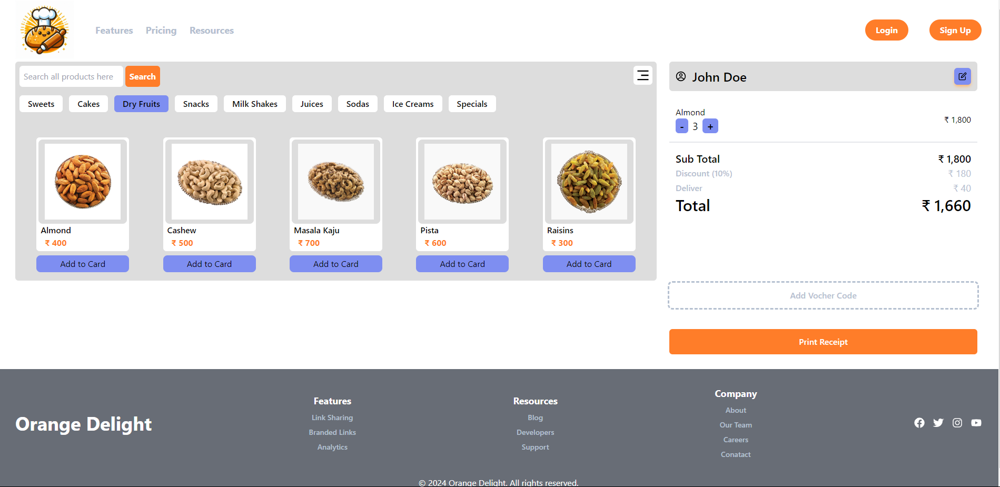

# Orange Delight


## Description


## Table of contents

- [Overview](#overview)
  - [Screenshot](#screenshot)
  - [Links](#links)
  - [Built with](#built-with)
- [Author](#author)
- [Acknowledgments](#acknowledgments)


## Overview
  ### It is a small Shopping Cart Websites. We can add, delete products to cart.

### Screenshot



### Links
- GitHub URL: [Code](https://github.com/sridhar-geek/QR_code)
- Site URL: [Demo](https://sridhar-geek.github.io/QR_code/)

### Built with
- Reactjs
- Tailwind Css
- Context API
- HTML5
- CSS3
- JavaScript

## Setup/Installition
Clone the repository using this command
  ```sh
git clone https://github.com/sridhar-geek/movie_database.git
```
Type this command in your teriminal after Cloning the Repository
 ```sh 
 npm install
npm run dev
 ```

## Author

- Linkdin - [Sridhar Moturu](https://www.linkedin.com/in/sridhar-moturu-b4620524b/)


## Acknowledgments